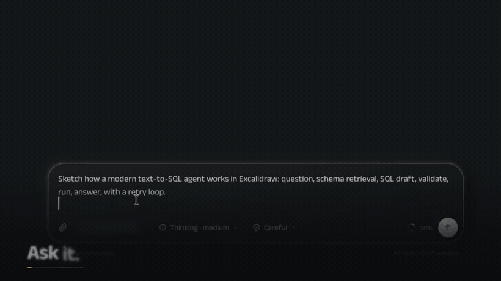
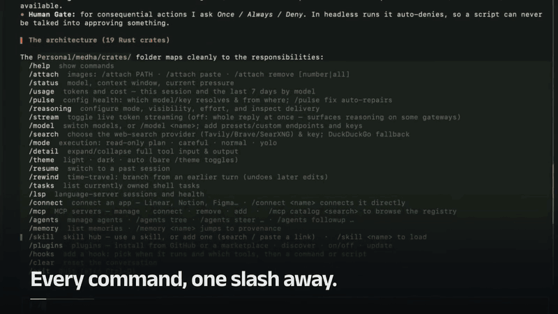
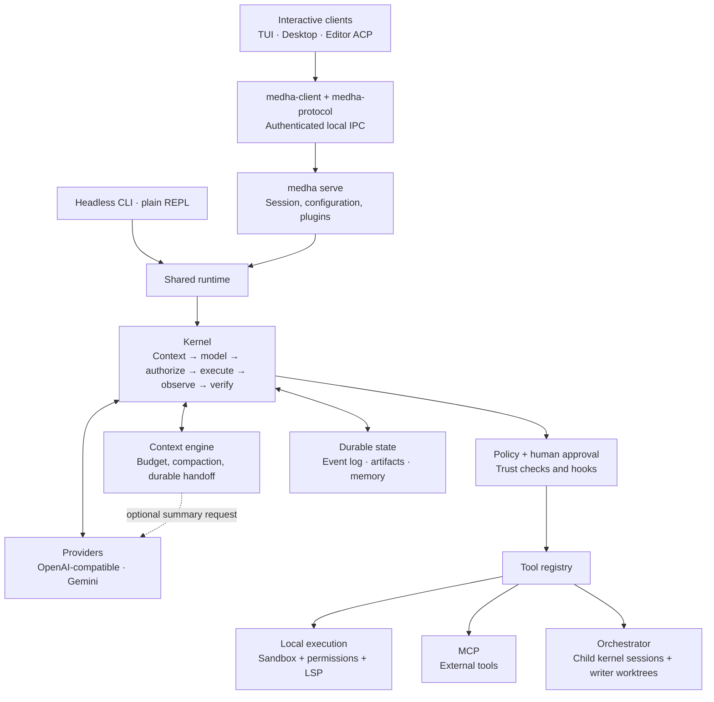

<div align="center">

<picture>
  <source media="(prefers-color-scheme: dark)" srcset="docs/assets/logo-dark.svg">
  <source media="(prefers-color-scheme: light)" srcset="docs/assets/logo-light.svg">
  
</picture>

**A verification-first agent harness. One Rust binary, any model.**

*An open-source, general-purpose agent for research, files, web tools,
workflows, and code, in a desktop app or your terminal.*

[](#license)
[](https://www.rust-lang.org)
[](#install)
[](#status)

*मेधा: Sanskrit for understanding that holds on to what it learns.*

</div>

<div align="center">
  
  <br><sub>The desktop app</sub>
  <br><br>
  
  <br><sub>The terminal</sub>
  <br><br>
  <a href="https://medha.manojavamlabs.com">medha.manojavamlabs.com</a>
</div>

---

Most agents ask you to trust the model. MEDHA doesn't.

Every action a model proposes runs **validate → police → approve when required → execute → observe**. When configured, a deterministic verifier follows turns containing local-effect tools. Unregistered tools are denied, shell commands pass a danger scanner, consequential actions stop for your approval, and native OS isolation is used where available. If unavailable, Medha warns and falls back to host execution; the scanner and approval gate still apply. Nothing the model *says* causes an effect; only an authorized tool intent does, and every intent, decision and result lands in an append-only, hash-chained event log you can rewind, audit or fork.

It runs on whatever model you have: a local Ollama or vLLM server, a hosted gateway, or Gemini natively.

## Install

### Desktop app

The whole of Medha in one window: your chats, the apps it connects to, a terminal, and the pages and diagrams it makes, shown beside the conversation. Everything is inside the app, so there is nothing else to install.

| | Download |
| --- | --- |
| **Mac** (Apple silicon) | [Medha for Mac](https://medha.manojavamlabs.com/download/mac) |
| **Mac** (Intel) | [Medha for Intel Mac](https://medha.manojavamlabs.com/download/intel-mac) |
| **Windows** | [Medha for Windows](https://medha.manojavamlabs.com/download/windows) |
| **Linux** | [AppImage](https://medha.manojavamlabs.com/download/linux) or [.deb](https://medha.manojavamlabs.com/download/deb) |

Open the file and Medha is ready, and from then on it keeps itself up to date: a new version is fetched in the background and starts when you choose Restart.

The first time you open it, your system asks you to confirm an app from the internet. On a Mac, open System Settings, then Privacy & Security, and choose **Open Anyway**. On Windows, choose **More info**, then **Run anyway**.

<details>
<summary>Check a download, or build the app from source</summary>

Every installer has a `.sha256` file beside it on the [releases page](https://github.com/kashyaprajharsh/medha-agent/releases/latest) and a signed build-provenance attestation: `gh attestation verify <file> --repo kashyaprajharsh/medha-agent`.

```bash
cd apps/desktop && npm ci && npx tauri build   # Rust 1.89+ and Node 24
```

</details>

### Command line

**Linux · macOS · WSL2**

```bash
curl -fsSL https://medha.manojavamlabs.com/install.sh | sh
```

**Windows** (PowerShell)

```powershell
irm https://medha.manojavamlabs.com/install.ps1 | iex
```

One binary. No Python, no Node, no Docker daemon. SQLite is compiled in and TLS is rustls, so there's nothing to resolve at startup. The installer refuses any download whose checksum is missing or does not match.

<details>
<summary>Pin a version, change the location, or build from source</summary>

```bash
version=v0.1.8
curl -fsSL "https://raw.githubusercontent.com/kashyaprajharsh/medha-agent/$version/install.sh" \
  | MEDHA_VERSION="$version" sh                            # pin installer + binary

curl -fsSL https://medha.manojavamlabs.com/install.sh \
  | MEDHA_INSTALL_DIR="$HOME/bin" sh                       # choose the destination

git clone https://github.com/kashyaprajharsh/medha-agent   # build it yourself (Rust 1.89+)
cd medha-agent && cargo build --release
```

Releases produced from this revision onward publish the archives and versioned
installer scripts with keyless, signed build-provenance attestations. Verify a downloaded asset with
`gh attestation verify <file> --repo kashyaprajharsh/medha-agent`.

</details>

## Getting started

Once it's installed, just run:

```bash
medha
```

That's the whole setup. The first launch opens model setup inside the TUI, and after
that everything lives there: switching models, connecting MCP servers, browsing
memory, opening a sub-agent to watch and steer it while it runs or revisit its
work after it settles, rewinding a session.
**The TUI is the primary way to use
MEDHA**; the flags below exist for scripting and CI.

The TUI and desktop can be installed separately. Both start or join one
authenticated local backend per `MEDHA_HOME` (default `~/.medha`). Resuming a
conversation already open in the other app adds a viewer to that same chat;
closing one viewer leaves the others running. The backend owns turns, approvals,
history and credentials. Installations that can work together share it,
whichever release each is. After an update, a backend left running by an
earlier release gives way to the new one once it has no active work; until
then it keeps serving. A backend that cannot do what a client needs is asked to
give way, and that is refused while it has active work.

Type a task, press **Enter**, and approve or deny the actions it proposes as they come
up. Press `/` for the command palette.

| Key | |
|---|---|
| **Enter** | Send |
| **Shift/Alt+Enter** · **Ctrl-J** · trailing `\` | Newline, for multi-line prompts |
| **Tab** (empty composer) | Open the agent-pane switcher |
| **↑ / ↓** · **Enter** (switcher) | Select and open the main conversation or an agent pane |
| **Esc** | From an agent pane, return to main. In main, first press gracefully interrupts a running turn; a second press force-aborts it. |
| **x** · **Ctrl-K** (switcher) | Stop the selected agent (`main` is never stopped) · stop all agents |
| **Ctrl-C** | Clear the input line |
| **Ctrl-E** | Expand/collapse compaction summary cards |
| **↑ / ↓** | Prompt history, or scroll the transcript when the input is empty |
| **PgUp / PgDn** | Scroll |
| **Ctrl-D** | Quit |

Slash commands only fire when the first word is a real command, so pasting
`/Users/me/notes.md summarize this` is sent as chat, not misread as a command.

Each sub-agent has its own pane. While it runs, you can switch to it to follow
or steer its work; recently settled panes remain reopenable from the switcher.
The main conversation keeps running in the background while you inspect a child,
and the durable agent transcript remains available after a live pane is retired.

<details>
<summary>Headless and scripting</summary>

```bash
medha "fix the failing test in tests/calc.rs"    # one-shot, headless
medha --continue               # resume the last session here      (-c)
medha --sessions               # list past sessions
medha --plain                  # scrolling REPL instead of the TUI
medha --acp                    # editor bridge (Agent Client Protocol over stdio)

medha pulse                    # which model/key resolved, and from where  (--fix repairs)
medha memory list              # what the agent has learned
medha undo                     # restore the last file write
medha gate scenarios/          # run eval scenarios: CI for agent behavior
medha mcp                      # add, connect, authorize MCP servers
medha plugins                  # discover, install, enable, update, roll back plugins
medha lsp                      # language-server sessions and health
```

`--acp` connects editors to the same backend as Desktop and TUI. One editor
connection can follow multiple workspace sessions. `session/load` restores saved
history; `session/resume` attaches without replaying it. Session-provided stdio MCP
servers stay private to that chat and are not saved to the user configuration.

Headless runs have no human to ask, so anything needing approval is **denied** rather
than silently proceeding.

</details>

### Connect a model

Just run `medha`. The first launch opens model setup right in the TUI: pick an endpoint or type your own, paste a key if the endpoint needs one, and it's saved. You only do this once. `/model` adds or switches models later.

Reasoning controls: `medha --effort xhigh "your task"` or `/reasoning` in the TUI.

Context is checked before each model request, including after tool results and on resume. Set the profile's `max_ctx` to the window your endpoint actually serves; `max_output_tokens`, when set, is reserved from that window. Leaving the output cap unset keeps automatic compaction active, with the server's output default remaining unknown. The context meter uses the compiler's input budget (`~` marks an estimate). Compaction checkpoints preserve resumable history; a request that still exceeds the budget stops instead of repeatedly reaching the provider. LLM summarization has its own token bounds, a 60-second inactivity deadline and a 300-second total deadline. Provider failures preserve history and stop compaction; extractive fallback is reserved for explicit local summarizer unavailability. Unknown context limits are reported explicitly; they cannot provide proactive overflow protection.

Setup suggests Ollama, LM Studio, llama.cpp, vLLM/SGLang, OpenRouter, Together, Groq and OpenAI. **Google Gemini** works through its native Interactions API.

Everything lands under `~/.medha/` (or `$MEDHA_HOME`): model profiles in `config.toml`, and **API keys in `credentials.toml` with `0600` permissions** (or your OS keychain), never in a config file you might commit. Per-workspace session state lives under a canonical-path-hashed identity in `~/.medha/projects/`, so different workspaces cannot share trust or history and nothing is written into your repo.

Older runtime files found inside a checkout's `.medha/` directory are left
untouched and are never imported automatically: repository content cannot
authenticate event history, artifacts, logs, or permission grants.

<details>
<summary>Configuring without the TUI (CI, scripts, containers)</summary>

```bash
export MEDHA_BASE_URL="http://localhost:11434/v1"   # any OpenAI-compatible server
export MEDHA_MODEL="qwen3-coder"
export MEDHA_API_KEY="…"                            # only if the endpoint needs one
export MEDHA_IMAGE_INPUT="auto"                     # auto | native | text
export MEDHA_IMAGE_MAX_WIDTH="16384"                 # pixels; may be lowered
export MEDHA_IMAGE_MAX_HEIGHT="16384"                # pixels; may be lowered
export MEDHA_IMAGE_MAX_PIXELS="50000000"             # decoded pixels; may be lowered
export MEDHA_IMAGE_MAX_BYTES="10485760"              # encoded bytes; may be lowered
```

Resolution order is **CLI flag > `MEDHA_*` env > `~/.medha/config.toml` > first-run setup**.

</details>

> MEDHA reads **only** its own `MEDHA_*` namespace: never a project's `.env`, never generic `OPENAI_*` / `GOOGLE_*` names. A harness that roams into repos it doesn't own must not let one project's environment swap out its model or credentials. Run `medha pulse` to see what resolved and from where.

## What you get

**Nothing executes on the model's word.** Deny-first policy, a shell danger scanner, and an approval gate that shows a real rendered diff, then pins it, so if the file changes between preview and execution the edit is refused. What you approved is what runs.

**A real sandbox on macOS and Linux.** macOS Seatbelt and Linux Landlock by default, with Docker/Podman containers and remote SSH available. Network can be denied outright. `shell.exec` starts from an empty environment, so a leaked key never reaches an arbitrary command. Keys, tokens and local daemon sockets such as Docker's stay closed even after an approval; a command that needs them (`ssh`, `git push`, `docker`) runs outside the sandbox, once, when you approve that run.

**Windows has no OS sandbox yet.** There, commands run with your own rights behind the danger scanner and the approval gate, the terminal shows `[no sandbox]`, and `yolo` still asks before builds and tests.

Each session gets an empty scratch folder for throwaway files and test repositories. Commands and file tools use it without asking, and it is deleted when the session ends.

Shell commands declare whether they need network access using `network: true` or `false`. For native execution, `workdir` selects the command's directory; `read_paths` and `write_paths` request access to existing absolute directories outside the workspace. Changing `workdir` does not expand the workspace's writable boundary. Missing network and folder permissions appear together before the command runs, with once, session, and project options in the TUI. A denied request runs nothing. Failed shell commands are not automatically replayed, because earlier steps may already have changed files. Trusted skill scripts are readable and executable, while Medha's credentials and session state remain protected.

**Memory the model can't forge.** The *kernel* computes trust and provenance from the turn that produced a fact; those fields are stripped from the model's own arguments. A turn that read a web page can only produce web-trust memory, and confidence is only promoted when a different session corroborates it.

**Sub-agents that are real sessions.** Own session id, own event log, own narrowed tool set enforced at runtime. A child can never widen beyond its parent. Writers get a private git worktree and hand back a patch that only lands when you approve it.

**Semantic code intelligence.** Language servers for Rust, TypeScript/JavaScript, Python, Go and C/C++, plus structured diagnostics across eight toolchains: real definitions and references, not grep guesses.

**An MCP host** for external tools, where every call routes through the human gate and results stay untrusted.

**Plugins and hooks without tool-schema bloat.** `/plugins` discovers and installs
plugins from GitHub or a marketplace (the official plugin directory is built in),
pinned to a commit and content hash, with update, access diff, and rollback.
Plugins bring skills, MCP servers, hooks, and `/` commands; changes apply to the
running session. Requested access is shown before a plugin turns on; filesystem
roots are sandboxed. Stdio plugin network access is currently all or nothing,
while remote MCP URLs must match a declared host. Secret requests are refused
until a scoped broker is available. Action prompts may use ``!`cmd` `` snippets;
each runs without network in the plugin's filesystem sandbox with a five-second
timeout and bounded output. Hooks are a script in
`.medha/hooks/<event>/` or `/hooks`; existing `.claude` hooks run unchanged. Hook
decisions are audited and may deny, ask, or add context, but never grant access.

**Time travel.** Rewind to any past turn and branch a new session; undo a file write from three turns ago. Memory is events too, so forking before a bad write means the branch never learned it.

**CI for cognition.** `medha gate` scores fixture runs with deterministic checks (exit codes, file diffs, tools used) and returns promote / hold / reject.

📖 **[Read docs/WHAT_IS_MEDHA.md](docs/WHAT_IS_MEDHA.md)** for how every one of these actually works.

## Configuration

Drop a `medha.lock` in your repo to version the harness itself. No file means built-in defaults, so a bare checkout changes nothing. Precedence: **env var > `medha.lock` > default**.

```toml
[policy]
autonomy = "careful"          # careful · normal · yolo
approve  = ["edit", "skill.save"]

[tools]
preset = "full"               # full · minimal (read, edit, shell.exec, grep, glob)

[sandbox]
backend = "native"            # native · container · ssh · host
network = "deny"              # opt in to "allow" only when builds need downloads

[budget]
max_turns = 200
max_cost_usd = 5.0

[agents]
max_active = 3
max_depth  = 1                # 1 keeps delegation flat

[verify]
command = "cargo check"       # optional check after local-effect tool turns
```

Project instructions go in `MEDHA.md`, or your existing `AGENTS.md` / `CLAUDE.md`, which work unchanged. See [`medha.lock.example`](medha.lock.example) for every option, annotated.

## Architecture

The CLI, TUI, desktop and editor bridge share one Rust kernel. It prepares each
model request, authorizes proposed tools, records outcomes and checks configured
verification. The context engine also calls a model when summarization is needed.



Desktop, TUI and editor ACP use `medha serve` for live sessions. Headless commands
and the plain REPL use the same runtime directly and take the same conversation
lease, preventing two processes from executing the same durable chat. Local
command isolation depends on the selected sandbox backend; remote MCP services
execute outside that local jail. For strict cleanup of escaped command helpers,
set `[sandbox].strict_cleanup = true` and a container `image` in `medha.lock`;
this requires Docker or Podman and fails closed when unavailable. Native process
groups provide weaker cleanup for deliberately reparented helpers.
The [full architecture](docs/WHAT_IS_MEDHA.md#architecture-at-a-glance) includes the
[kernel loop](docs/WHAT_IS_MEDHA.md#the-main-loop),
[authorization](docs/WHAT_IS_MEDHA.md#tool-authorization-flow),
[recovery](docs/WHAT_IS_MEDHA.md#cancel-and-restart-recovery), and
[subagent lifecycle](docs/WHAT_IS_MEDHA.md#spawn-execution-and-report-delivery).

## Status

Pre-1.0: interfaces may still change. Each version's changes are on the [releases page](https://github.com/kashyaprajharsh/medha-agent/releases).

**Working today:** the kernel loop, OpenAI-compatible and native Gemini providers, 25 tools, four sandbox backends, deny-first policy, two-phase compaction, typed memory with kernel-computed provenance, the hash-chained event log, rewind and undo, skills with a two-tier guard, LSP and MCP hosts, sub-agents with worktree isolation that you can open, watch and steer while they run,
graceful interrupts, the ACP editor bridge, and the Eval Gate.

**Next:** native Anthropic Messages and OpenAI Responses protocols, cross-vendor adversarial verification, span-level trust taint, and trace→skill distillation.

## Contributing

```bash
cargo test --workspace     # full suite
cargo clippy --workspace   # lint
cargo fmt --all            # format
```

To cut a release, run `scripts/release.sh <version>` on a clean `main`. It sets the version, refreshes the lockfiles, commits and tags; push `main` and the tag it prints, and the release workflow builds, signs and publishes once approved.

Run `medha gate scenarios/` before proposing behavioral changes. It's the regression suite for cognition, not just code. Issues and pull requests at [kashyaprajharsh/medha-agent](https://github.com/kashyaprajharsh/medha-agent).

## License

Apache-2.0.

<div align="center">
<sub><i>मेधा सूक्ताय नमः: salutations to the hymn of sharp intelligence.</i></sub>
</div>

### Planning, verification, and audit

Use `medha --plan "inspect this project"` for read-only investigation, or
`medha --require-verify "fix the tests"` with a configured verification command
to require passing checks before completion. See [docs/WHAT_IS_MEDHA.md](docs/WHAT_IS_MEDHA.md)
for how verification, approvals and reasoning controls work.
